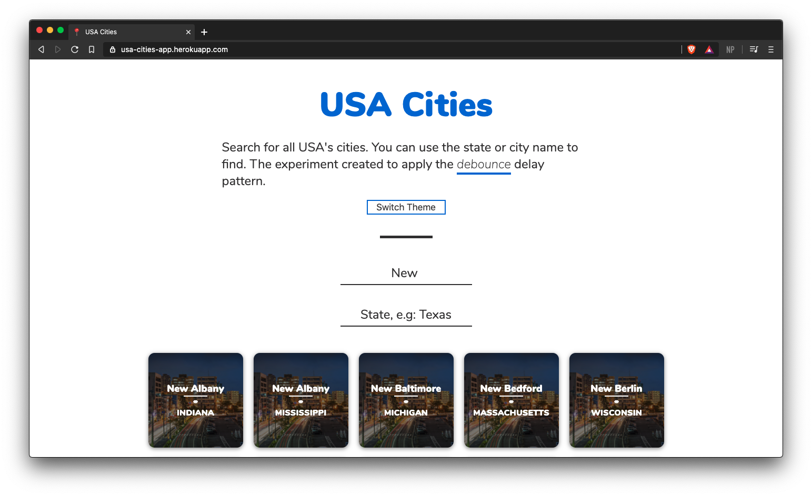

# 📍 USA Cities

> A unusual experiment with RXJS to work with events applying debounce delay technique.

### What is debounce?
***"The debounce function delays the processing of the keyup event until the user has stopped typing for a predetermined amount of time. This prevents your UI code from needing to process every event and also drastically reduces the number of API calls sent to your server."*** - short description extracted from [this amazing post about debounce in JavaScript](https://levelup.gitconnected.com/debounce-in-javascript-improve-your-applications-performance-5b01855e086).

### Description
The project uses the debounce delay technique to handle the user interaction with the inputs and them fetch the data from [this api](https://github.com/felipesousa/usa-cities-api) that return a filtered data from the cities/states from the USA.  

### Features/Stack
* React as a compiler.
* RxJS to work with Observables.
* Dark mode with Styled Components.
